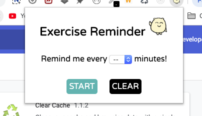
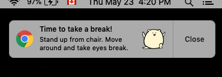

This chrome extension will continuously produce a popup notification each time a user-specified time interval passes.

---

---

---

##How to try the demo

1. Download repository ZIP file and unzip it.
2. Open chrome and go to "chrome://extensions".
3. Toggle "Developer mode" button at the right corner.
4. Click "Load unpacked" button at the left and select the unzipped file.
5. Ta-da!
